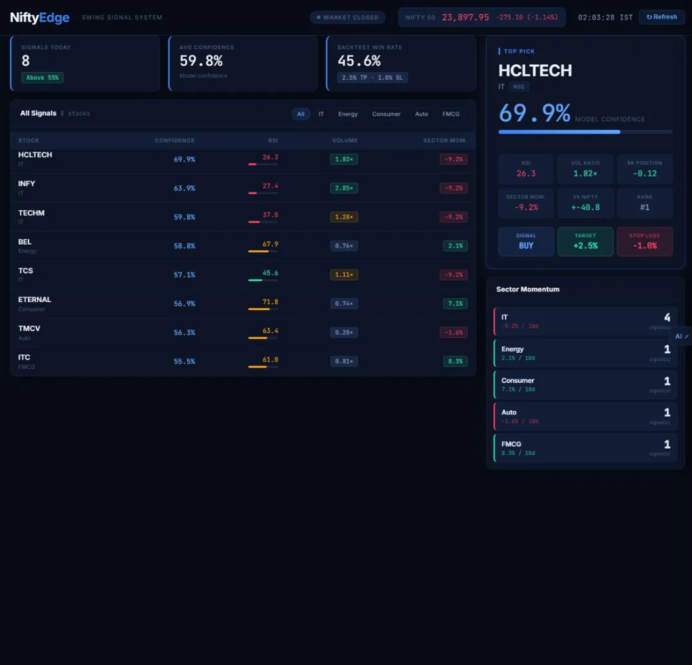

# 💎 NiftyEdge
### The Ultimate Swing Trading Command Center for Nifty 50



<div align="center">

[](https://react.dev/)
[](https://vitejs.dev/)
[](https://www.netlify.com/)
[](https://niftyedge.netlify.app)

</div>

---

## 🚀 Overview

**NiftyEdge** is a premium, real-time trading dashboard designed to surface high-probability swing trading setups within the Nifty 50 universe. It serves as the visual command center for a proprietary machine-learning engine, providing traders with institutional-grade data visualization and AI-powered technical analysis.

🌐 **Live Demo:** [niftyedge.netlify.app](https://niftyedge.netlify.app)

---

## ✨ Key Features

- **🎯 Actionable Signals** — Ranked list of setups with confidence scores, RSI indicators, and volume confirmation.
- **🔥 Sector Momentum** — Real-time tracking of capital flow across IT, Energy, Consumer, Auto, and FMCG sectors.
- **💎 Top Pick Spotlight** — A dedicated high-conviction card featuring detailed breakdown: RSI, Vol Ratio, BB Position, and R:R targets.
- **🤖 AI Analyst Logic** — Integrated sidekick (accessible via the 'AI' float) that provides context-aware trade commentary.
- **⚡ Market Pulse** — Live Nifty 50 indexing, signal counts, and aggregate model confidence metrics.
- **📈 Backtest Transparency** — Integrated win-rate metrics and trade parameter tracking (2.5% TP / 1.0% SL).

---

## 🛠️ Tech Stack

| Layer | Technology | Role |
| :--- | :--- | :--- |
| **Core** | **React 19** | Modern, declarative UI foundation |
| **Build** | **Vite** | Lightning-fast HMR and optimized bundling |
| **Logic** | **Netlify Edge** | Serverless functions for high-performance data proxying |
| **Intelligence** | **FastAPI + XGBoost** | Separate backend engine for signal generation |
| **Design** | **CSS Variables** | Token-based theme system with glassmorphic accents |

---

## 📂 Project Structure

```text
├── src/
│   ├── components/       # Reusable UI (ChatPanel, SignalsTable, etc.)
│   ├── hooks/            # Logic (useSignals, useNiftyPrice)
│   ├── App.jsx           # Dashboard layout shell
│   └── index.css         # Dracula-inspired design tokens
├── netlify/
│   └── edge-functions/   # Performance-optimized API proxies
├── public/               # Static assets & redirects
└── docs/assets/          # Project documentation media
```

---

## 🎨 Design System

NiftyEdge utilizes a **Cinematic Dark** aesthetic optimized for high-density data processing and visual focus.

- **Primary Palette:** Deep Navy (`#070b14`) background with Electric Blue and Emerald Green accents.
- **Typography:** Inter for clarity, JetBrains Mono for technical data points.
- **Visual Style:** High-contrast cards, glowing confidence bars, and a clean three-column grid layout.
- **Interactions:** Responsive filtering by sector (IT, Energy, Auto, etc.) and real-time state updates.

---

## 🚦 Getting Started

### 1. Prerequisites
- Node.js 18+
- [NiftyEdge API](https://github.com/AakashVijeta/NiftyEdge-backend) (running locally or deployed)

### 2. Installation
```bash
git clone https://github.com/AakashVijeta/NiftyEdge.git
cd NiftyEdge
npm install
```

### 3. Configuration
The dashboard communicates with the signal engine. Update the API endpoints in:
- `src/hooks/useSignals.jsx`
- `src/components/ChatPanel.jsx`

### 4. Development
```bash
npm run dev
```

---

## 📈 Pipeline Workflow

The frontend acts as the final consumer of the NiftyEdge data pipeline:
1. **API** ingests OHLCV data from Yahoo Finance.
2. **ML Engine** computes 12+ technical features and generates probabilities.
3. **Frontend** (NiftyEdge) renders these signals into an actionable, real-time dashboard.

---

## 🔗 Related Repositories
- [⚡ NiftyEdge API](https://github.com/AakashVijeta/NiftyEdge-backend) - The machine learning core.

---

## ⚠️ Disclaimer
NiftyEdge is an educational research tool. Signals are probabilistic outputs and do **not** constitute financial advice. Trading involves significant risk. Always perform your own due diligence.
